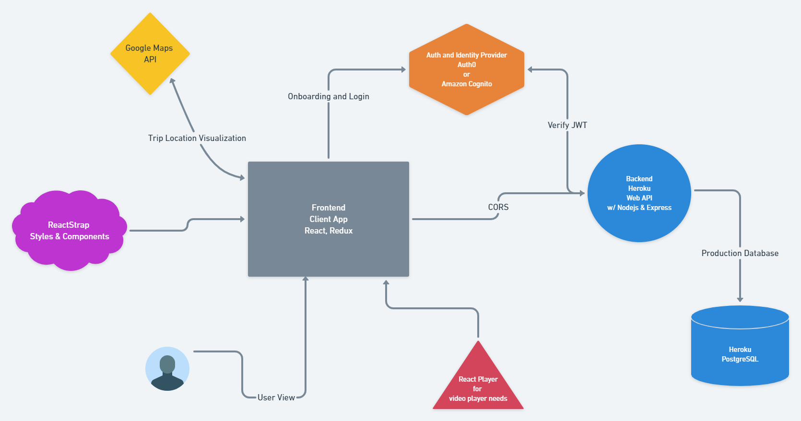

# Field Trip Planner Frontend

### About

FTP is an app that consolidates all the aspects of planning, preparing and executing a field trip succesfully.

#### Tech Stack

HTML | CSS | Javascript | React | Redux | Node | Express | PostgreSQL | Reactstrap | Sass

#### Features

<li> User onboarding and subsequent user role assignment 
    <ul>
        <li>Teacher --- Create field trips/assign students
        <li>Parent --- sign permission slips electronically/ view field trip details
        <li>Student --- View field trip info
        <li>Admin --- authorize/validate teacher on boarding/ftp
        <li>Transportation --- relay eta/ view field trip info
    </ul>
<li>Create and edit fieldtrips

### App Architecture

Preliminary Structure

